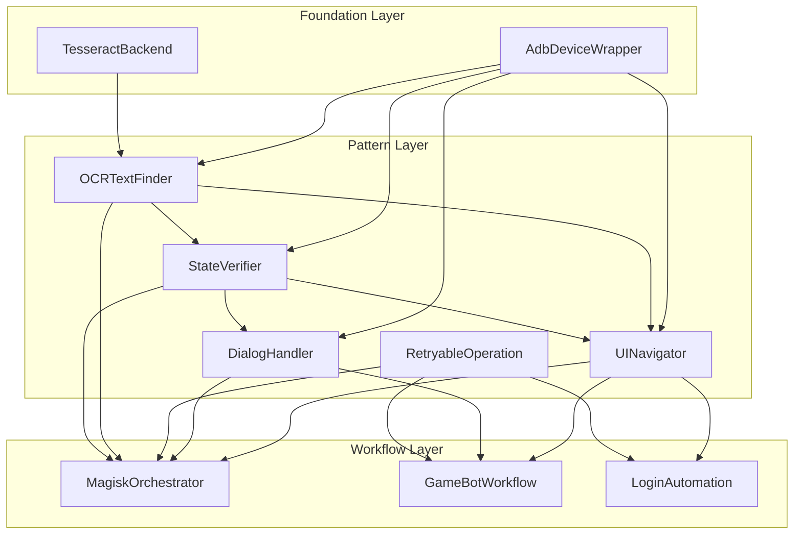
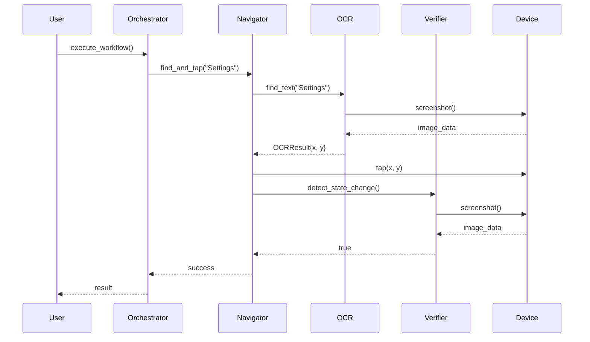

# ADB Automation Patterns Reference

**Version**: 1.0.0
**Last Updated**: 2025-12-02
**Status**: Active

A comprehensive guide to the 5 reusable OCR automation patterns for building ADB-based device automation skills.

---

## 1. Overview

### What Are Patterns?

Patterns are reusable, composable building blocks for ADB device automation. Each pattern encapsulates a specific capability:

- **OCRTextFinder** - Find and locate text on device screen
- **StateVerifier** - Verify device state conditions
- **MenuNavigator** (UINavigator) - Navigate UI with OCR-guided taps
- **DialogHandler** - Handle popups and confirmation dialogs
- **RetryableOperation** - Execute operations with automatic retry

### Why Use Patterns?

| Benefit | Description |
|---------|-------------|
| **Reusability** | Write once, use across multiple automation skills |
| **Composability** | Combine patterns for complex workflows |
| **Testability** | Each pattern can be tested in isolation |
| **Maintainability** | Single source of truth for each capability |
| **Error Handling** | Built-in retry and recovery mechanisms |

### Pattern Locations

```
.claude/skills/adb/
├── adb-ocr-detection/         # OCRTextFinder pattern
│   └── adb_ocr_finder.py
├── adb-state-verification/    # StateVerifier + DialogHandler patterns
│   └── adb_state_checker.py
├── adb-ui-navigation/         # MenuNavigator pattern
│   └── adb_ui_navigator.py
└── adb-magisk-orchestration/  # Composition example
    └── adb_magisk_orchestrator.py
```

---

## 2. Pattern Catalog

### Pattern 1: OCRTextFinder

**Purpose**: Find and locate text on device screen using Tesseract OCR.

**Problem Solved**: Enables text-based element detection when UI element IDs are unavailable or unreliable.

#### Interface

```python
class OCRTextFinder:
    def __init__(
        self,
        device: AdbDeviceWrapper,
        ocr_config: Optional[TesseractConfig] = None,
        min_confidence: ConfidenceValue = ConfidenceValue(0.6)
    )

    # Core Methods
    def find_text(self, target_text: str) -> Optional[OCRResult]
    def find_text_region(
        self, target_text: str,
        region: Optional[tuple[int, int, int, int]] = None
    ) -> Optional[OCRResult]
    def wait_for_text(
        self, target_text: str,
        timeout_seconds: int = 10,
        check_interval: float = 0.5
    ) -> bool
    def find_all_text(self) -> list[OCRResult]
    def find_text_blocks(self) -> list[OCRResult]
    def find_text_with_retry(
        self, target_text: str,
        max_retries: int = 3,
        retry_delay: float = 0.5
    ) -> Optional[OCRResult]
```

#### Usage Example

```python
from adb_auto_player.device.adb.adb_device import AdbDeviceWrapper
from adb_ocr_finder import OCRTextFinder

# Initialize
device = AdbDeviceWrapper.create_from_settings()
ocr_finder = OCRTextFinder(device, min_confidence=ConfidenceValue(0.7))

# Find specific text
result = ocr_finder.find_text("Settings")
if result:
    print(f"Found 'Settings' at {result.box}")
    center_x = result.box.start_point.x + (result.box.width // 2)
    center_y = result.box.start_point.y + (result.box.height // 2)

# Wait for text to appear (loading screens, transitions)
if ocr_finder.wait_for_text("Welcome", timeout_seconds=15):
    print("Welcome screen loaded")

# Search in specific region (optimization)
header_region = (0, 0, 1080, 200)  # Top 200 pixels
title = ocr_finder.find_text_region("Home", region=header_region)

# Find with retry (transient issues)
button = ocr_finder.find_text_with_retry("OK", max_retries=5)
```

#### Integration Points

- **StateVerifier**: Pass `find_all_text` to `verify_text_present()`
- **UINavigator**: Used internally by `find_and_tap()`
- **DialogHandler**: Text detection for button identification

#### Configuration Options

| Parameter | Type | Default | Description |
|-----------|------|---------|-------------|
| `device` | AdbDeviceWrapper | Required | ADB device connection |
| `ocr_config` | TesseractConfig | None | Custom Tesseract settings |
| `min_confidence` | ConfidenceValue | 0.6 | Minimum OCR confidence (0.0-1.0) |
| `timeout_seconds` | int | 10 | Wait timeout for `wait_for_text()` |
| `check_interval` | float | 0.5 | Polling interval in seconds |
| `max_retries` | int | 3 | Retry attempts for `find_text_with_retry()` |

#### Error Handling

| Exception | Cause | Recovery |
|-----------|-------|----------|
| `RuntimeError` | Screenshot capture failed | Check device connection |
| `None` return | Text not found | Use `wait_for_text()` or retry |
| Low confidence | Poor image quality | Adjust `min_confidence` |

---

### Pattern 2: StateVerifier

**Purpose**: Verify device state using OCR and visual matching.

**Problem Solved**: Detect dialogs, state transitions, and verify pre/post conditions for automation steps.

#### Interface

```python
class StateType(Enum):
    TEXT_PRESENT = "text_present"
    TEXT_ABSENT = "text_absent"
    DIALOG_VISIBLE = "dialog_visible"
    DIALOG_HIDDEN = "dialog_hidden"
    APP_FOREGROUND = "app_foreground"
    CUSTOM_CONDITION = "custom_condition"

class StateVerifier:
    def __init__(self, device: AdbDeviceWrapper)

    # Verification Methods
    def verify_state(self, condition: Callable[[np.ndarray], bool]) -> bool
    def verify_text_present(self, text: str, ocr_func: Callable) -> bool
    def verify_text_absent(self, text: str, ocr_func: Callable) -> bool
    def detect_dialog(self) -> bool
    def wait_for_state(
        self, condition: Callable[[np.ndarray], bool],
        timeout_seconds: int = 10,
        check_interval: float = 0.5
    ) -> bool
    def detect_state_change(
        self, timeout_seconds: int = 5,
        check_interval: float = 0.25
    ) -> bool

    # History Management
    def get_state_history(self) -> List[Dict[str, Any]]
    def clear_state_history() -> None
```

#### Usage Example

```python
from adb_state_checker import StateVerifier, StateType

# Initialize
device = AdbDeviceWrapper.create_from_settings()
verifier = StateVerifier(device)

# Verify text is present (uses OCR function)
def get_all_text():
    return ocr_finder.find_all_text()

if verifier.verify_text_present("Login", get_all_text):
    print("Login screen detected")

# Verify text is NOT present (success condition)
if verifier.verify_text_absent("Error", get_all_text):
    print("No error messages found")

# Detect dialog popup
if verifier.detect_dialog():
    print("Dialog detected - need to handle")

# Custom condition (lambda for flexibility)
def is_loading_complete(image):
    # Custom logic: check for loading spinner absence
    return not has_loading_spinner(image)

verifier.wait_for_state(is_loading_complete, timeout_seconds=30)

# Detect screen changes after tap
device.tap("540", "960")
if verifier.detect_state_change(timeout_seconds=3):
    print("Screen changed after tap")
```

#### Integration Points

- **OCRTextFinder**: Provides OCR functions for text verification
- **UINavigator**: Uses `detect_state_change()` for tap verification
- **DialogHandler**: Uses `detect_dialog()` for popup detection

#### Configuration Options

| Parameter | Type | Default | Description |
|-----------|------|---------|-------------|
| `device` | AdbDeviceWrapper | Required | ADB device connection |
| `timeout_seconds` | int | 10 | Wait timeout for state changes |
| `check_interval` | float | 0.5 | Polling interval in seconds |
| `edge_density` | float | 0.05-0.15 | Dialog detection threshold |
| `mse_threshold` | float | 100 | State change detection sensitivity |

#### Error Handling

| Exception | Cause | Recovery |
|-----------|-------|----------|
| `RuntimeError` | Screenshot capture failed | Check device connection |
| `False` return | Condition not met | Increase timeout, check prerequisites |
| History overflow | Too many checks | History auto-prunes to 100 records |

---

### Pattern 3: MenuNavigator (UINavigator)

**Purpose**: Navigate device UI using OCR-guided tap sequences.

**Problem Solved**: Automate UI navigation without hardcoded coordinates, adapting to text changes and screen layouts.

#### Interface

```python
@dataclass
class TapTarget:
    x: int
    y: int
    element_text: str = ""
    confidence: float = 0.0
    attempts: int = 0

class UINavigator:
    def __init__(
        self,
        device: AdbDeviceWrapper,
        ocr_finder: Callable = None,
        state_verifier: Callable = None
    )

    # Navigation Methods
    def find_and_tap(
        self, target_text: str,
        timeout_seconds: int = 5,
        post_tap_delay: float = 0.5,
        verify_after_tap: bool = False
    ) -> bool
    def navigate_to_button(
        self, button_text: str,
        max_taps: int = 1,
        post_tap_delay: float = 1.0
    ) -> bool
    def navigate_menu(
        self, menu_items: List[str],
        timeout_per_item: int = 3
    ) -> bool
    def find_and_tap_with_retry(
        self, target_text: str,
        max_retries: int = 3,
        retry_delay: float = 1.0,
        post_tap_delay: float = 0.5
    ) -> bool

    # Dialog Handling
    def handle_dialog(
        self, button_to_click: str,
        timeout_seconds: int = 5,
        verify_dialog_closed: bool = True
    ) -> bool

    # System Navigation
    def press_back(self, num_times: int = 1, delay_between: float = 0.5) -> bool
    def press_home(self) -> bool
    def double_tap(self, target_text: str, delay_between: float = 0.1) -> bool

    # History Management
    def get_tap_history(self) -> List[TapTarget]
    def clear_tap_history(self) -> None
```

#### Usage Example

```python
from adb_ui_navigator import UINavigator

# Initialize with dependencies
device = AdbDeviceWrapper.create_from_settings()
ocr_finder = OCRTextFinder(device)
state_verifier = StateVerifier(device)

navigator = UINavigator(
    device=device,
    ocr_finder=ocr_finder,
    state_verifier=state_verifier
)

# Simple tap on text
if navigator.find_and_tap("Settings"):
    print("Tapped Settings button")

# Navigate through menu sequence
menu_path = ["Settings", "Privacy", "Permissions"]
if navigator.navigate_menu(menu_path):
    print("Navigated to Permissions screen")

# Tap with verification (ensures screen changed)
navigator.find_and_tap("Submit", verify_after_tap=True)

# Handle dialog
navigator.handle_dialog("OK", verify_dialog_closed=True)

# Tap with scrolling support
navigator.navigate_to_button("Accept Terms", max_taps=1)

# Multiple back presses
navigator.press_back(num_times=3)

# Review navigation history
for tap in navigator.get_tap_history():
    print(f"Tapped '{tap.element_text}' at ({tap.x}, {tap.y})")
```

#### Integration Points

- **OCRTextFinder**: Required for text location
- **StateVerifier**: Optional for tap verification
- **DialogHandler**: Internally uses `handle_dialog()`
- **MagiskOrchestrator**: Primary navigation component

#### Configuration Options

| Parameter | Type | Default | Description |
|-----------|------|---------|-------------|
| `device` | AdbDeviceWrapper | Required | ADB device connection |
| `ocr_finder` | OCRTextFinder | None | OCR for text detection |
| `state_verifier` | StateVerifier | None | For tap verification |
| `timeout_seconds` | int | 5 | Text detection timeout |
| `post_tap_delay` | float | 0.5 | Delay after tap (UI settle) |
| `max_retries` | int | 3 | Retry attempts |
| `scroll_distance` | int | 500 | Pixels to scroll |

#### Error Handling

| Exception | Cause | Recovery |
|-----------|-------|----------|
| `False` return | Text not found | Try scrolling, check screen state |
| OCR not available | Missing ocr_finder | Initialize with OCRTextFinder |
| Dialog still visible | Click missed | Retry tap, check button text |

---

### Pattern 4: DialogHandler

**Purpose**: Handle dialogs and popups on device.

**Problem Solved**: Automate dismissal of confirmation dialogs, permission requests, and unexpected popups.

#### Interface

```python
class DialogHandler:
    def __init__(
        self,
        device: AdbDeviceWrapper,
        state_verifier: StateVerifier
    )

    # Dialog Actions
    def handle_confirmation_dialog(
        self, action: str = "confirm",
        timeout_seconds: int = 5
    ) -> bool
    def handle_permission_dialog(self, action: str = "allow") -> bool
    def dismiss_dialogs(self, max_dismissals: int = 5) -> int
```

#### Usage Example

```python
from adb_state_checker import StateVerifier, DialogHandler

# Initialize
device = AdbDeviceWrapper.create_from_settings()
state_verifier = StateVerifier(device)
dialog_handler = DialogHandler(device, state_verifier)

# Handle confirmation dialog
if state_verifier.detect_dialog():
    dialog_handler.handle_confirmation_dialog(action="confirm")

# Handle permission request
dialog_handler.handle_permission_dialog(action="allow")

# Dismiss all visible dialogs (up to 5)
dismissed_count = dialog_handler.dismiss_dialogs(max_dismissals=5)
print(f"Dismissed {dismissed_count} dialogs")

# Integration with workflow
def safe_navigation(navigator, target):
    """Navigate with dialog handling."""
    # First dismiss any blocking dialogs
    dialog_handler.dismiss_dialogs()

    # Then navigate
    return navigator.find_and_tap(target)
```

#### Integration Points

- **StateVerifier**: Required for dialog detection
- **UINavigator**: Alternative for text-based dialog handling
- **Workflow Orchestrators**: Pre-step dialog clearing

#### Configuration Options

| Parameter | Type | Default | Description |
|-----------|------|---------|-------------|
| `device` | AdbDeviceWrapper | Required | ADB device connection |
| `state_verifier` | StateVerifier | Required | For dialog detection |
| `action` | str | "confirm" | "confirm"/"cancel" or "allow"/"deny" |
| `max_dismissals` | int | 5 | Maximum dialogs to dismiss |
| `timeout_seconds` | int | 5 | Button detection timeout |

#### Error Handling

| Exception | Cause | Recovery |
|-----------|-------|----------|
| `False` return | Button not found | Use back key as fallback |
| Dialog persists | Wrong button text | Try alternative text |
| Max dismissals reached | Infinite dialog loop | Investigate root cause |

---

### Pattern 5: RetryableOperation

**Purpose**: Execute operations with automatic retry on failure.

**Problem Solved**: Handle transient failures from network issues, timing problems, or UI lag.

#### Interface

```python
# Implemented in MagiskOrchestrator as reusable pattern
def execute_with_retry(
    operation: Callable,
    args: List[Any] = [],
    max_retries: int = 3,
    retry_delay: float = 2.0,
    on_retry: Optional[Callable] = None
) -> Any

# Phase-based retry (MagiskOrchestrator)
def _execute_phase_with_retry(
    self,
    phase_func: Callable,
    args: List[Any],
    max_retries: int = 3
) -> PhaseResult
```

#### Usage Example

```python
# Simple retry wrapper
def execute_with_retry(operation, args=[], max_retries=3, retry_delay=2.0):
    """Execute operation with retry logic."""
    last_error = None

    for attempt in range(max_retries):
        try:
            result = operation(*args)
            if result:  # Success condition
                return result

            if attempt < max_retries - 1:
                time.sleep(retry_delay)

        except Exception as e:
            last_error = e
            if attempt < max_retries - 1:
                logger.warning(f"Attempt {attempt + 1} failed: {e}")
                time.sleep(retry_delay)

    raise RuntimeError(f"Failed after {max_retries} attempts: {last_error}")

# Usage with OCR
result = execute_with_retry(
    ocr_finder.find_text,
    args=["Settings"],
    max_retries=5,
    retry_delay=1.0
)

# Usage with UINavigator
execute_with_retry(
    navigator.find_and_tap,
    args=["Submit"],
    max_retries=3
)

# Phase-based retry (complex workflows)
@dataclass
class PhaseResult:
    phase_number: int
    phase_name: str
    status: PhaseStatus
    retry_count: int = 0
    error: Optional[str] = None
    data: Dict[str, Any] = field(default_factory=dict)

    @property
    def success(self) -> bool:
        return self.status == PhaseStatus.SUCCESS

# Orchestrator pattern
class WorkflowOrchestrator:
    MAX_RETRIES = 3

    def _execute_phase_with_retry(self, phase_func, args, max_retries=3):
        last_result = None

        for attempt in range(max_retries):
            result = phase_func(*args)
            result.retry_count = attempt

            if result.success:
                return result

            if attempt < max_retries - 1:
                logger.warning(f"Phase failed (attempt {attempt + 1}/{max_retries})")
                time.sleep(2)

            last_result = result

        return last_result
```

#### Integration Points

- **All Patterns**: Can wrap any pattern method
- **Workflow Orchestrators**: Phase-level retry
- **Error Handlers**: Custom recovery strategies

#### Configuration Options

| Parameter | Type | Default | Description |
|-----------|------|---------|-------------|
| `max_retries` | int | 3 | Maximum retry attempts |
| `retry_delay` | float | 2.0 | Delay between retries (seconds) |
| `on_retry` | Callable | None | Hook for retry logging/metrics |
| `timeout` | float | None | Overall operation timeout |

#### Error Handling

| Exception | Cause | Recovery |
|-----------|-------|----------|
| `RuntimeError` | All retries exhausted | Escalate to user, fallback strategy |
| Timeout | Operation too slow | Increase timeout, optimize operation |
| Partial success | Some retries succeeded | Check result consistency |

---

## 3. Composition Examples

### Example 1: Login Automation

```python
class LoginAutomation:
    """Complete login workflow using pattern composition."""

    def __init__(self, device: AdbDeviceWrapper):
        self.device = device
        self.ocr_finder = OCRTextFinder(device)
        self.state_verifier = StateVerifier(device)
        self.navigator = UINavigator(device, self.ocr_finder, self.state_verifier)
        self.dialog_handler = DialogHandler(device, self.state_verifier)

    def login(self, username: str, password: str) -> bool:
        """Execute login workflow."""

        # 1. Dismiss any blocking dialogs
        self.dialog_handler.dismiss_dialogs()

        # 2. Wait for login screen
        if not self.ocr_finder.wait_for_text("Login", timeout_seconds=10):
            return False

        # 3. Find and tap username field
        if not self.navigator.find_and_tap("Username"):
            return False

        # 4. Enter credentials (using ADB input)
        self.device.shell(["input", "text", username])
        self.navigator.find_and_tap("Password")
        self.device.shell(["input", "text", password])

        # 5. Submit login
        self.navigator.find_and_tap_with_retry("Login", max_retries=3)

        # 6. Verify login success
        return self.state_verifier.verify_text_present(
            "Welcome", self.ocr_finder.find_all_text
        )
```

### Example 2: Settings Navigation

```python
class SettingsNavigator:
    """Navigate settings with state verification."""

    def __init__(self, device: AdbDeviceWrapper):
        self.device = device
        self.ocr_finder = OCRTextFinder(device)
        self.state_verifier = StateVerifier(device)
        self.navigator = UINavigator(device, self.ocr_finder, self.state_verifier)

    def navigate_to_setting(self, path: List[str]) -> bool:
        """Navigate through settings path with verification."""

        for i, menu_item in enumerate(path):
            # Verify current screen before navigation
            if i > 0:
                expected_text = path[i - 1]
                if not self.state_verifier.verify_text_present(
                    expected_text, self.ocr_finder.find_all_text
                ):
                    logger.warning(f"Expected screen not found: {expected_text}")

            # Navigate to next item
            if not self.navigator.find_and_tap(menu_item, verify_after_tap=True):
                # Try scrolling if not found
                for _ in range(3):
                    self.navigator._scroll_screen("down")
                    if self.navigator.find_and_tap(menu_item):
                        break
                else:
                    return False

        return True

    def toggle_setting(self, setting_name: str, enable: bool) -> bool:
        """Toggle a setting on/off."""

        # Find the setting
        result = self.ocr_finder.find_text(setting_name)
        if not result:
            return False

        # Get current state (look for toggle near text)
        # Tap to toggle
        self.navigator.find_and_tap(setting_name)

        # Verify state changed
        return self.state_verifier.detect_state_change()
```

### Example 3: Multi-Phase Workflow

```python
class GameBotWorkflow:
    """Multi-phase game automation with error recovery."""

    def __init__(self, device: AdbDeviceWrapper):
        self.device = device
        self.ocr_finder = OCRTextFinder(device)
        self.state_verifier = StateVerifier(device)
        self.navigator = UINavigator(device, self.ocr_finder, self.state_verifier)
        self.dialog_handler = DialogHandler(device, self.state_verifier)

    def execute_daily_routine(self) -> Dict[str, bool]:
        """Execute daily game routine with phase tracking."""

        results = {}

        phases = [
            ("collect_rewards", self._collect_rewards),
            ("complete_quests", self._complete_quests),
            ("claim_mail", self._claim_mail),
            ("arena_battles", self._arena_battles),
        ]

        for phase_name, phase_func in phases:
            try:
                # Clear dialogs before each phase
                self.dialog_handler.dismiss_dialogs()

                # Execute phase with retry
                success = self._execute_with_retry(phase_func)
                results[phase_name] = success

                if not success:
                    logger.warning(f"Phase {phase_name} failed, continuing...")

            except Exception as e:
                logger.error(f"Phase {phase_name} error: {e}")
                results[phase_name] = False

        return results

    def _execute_with_retry(self, func, max_retries=3):
        """Retry wrapper for phase functions."""
        for attempt in range(max_retries):
            try:
                if func():
                    return True
                time.sleep(2)
            except Exception as e:
                logger.warning(f"Attempt {attempt + 1} failed: {e}")
                time.sleep(2)
        return False

    def _collect_rewards(self) -> bool:
        """Collect daily rewards phase."""
        return self.navigator.navigate_menu(["Rewards", "Daily", "Collect All"])

    def _complete_quests(self) -> bool:
        """Complete daily quests phase."""
        return self.navigator.navigate_menu(["Quests", "Daily"])

    def _claim_mail(self) -> bool:
        """Claim mail rewards phase."""
        return self.navigator.navigate_menu(["Mail", "Claim All"])

    def _arena_battles(self) -> bool:
        """Execute arena battles phase."""
        return self.navigator.navigate_menu(["Arena", "Battle"])
```

---

## 4. Best Practices

### When to Use Each Pattern

| Pattern | Use When | Avoid When |
|---------|----------|------------|
| **OCRTextFinder** | UI element IDs unavailable, text-based detection needed | Static coordinates sufficient, performance critical |
| **StateVerifier** | Need to verify conditions, detect transitions | Simple tap-and-proceed workflows |
| **MenuNavigator** | Complex menu navigation, multi-step flows | Single tap operations |
| **DialogHandler** | Pop-ups and confirmations expected | No dialogs in workflow |
| **RetryableOperation** | Transient failures possible, network-dependent | Immediate failure required |

### Performance Optimization

```python
# 1. Use regions to limit OCR scope
header_region = (0, 0, 1080, 200)
ocr_finder.find_text_region("Title", region=header_region)

# 2. Reduce confidence for faster detection
ocr_finder = OCRTextFinder(device, min_confidence=ConfidenceValue(0.5))

# 3. Minimize unnecessary screenshots
# Cache last screenshot in StateVerifier (done automatically)

# 4. Adjust polling intervals based on expected delay
state_verifier.wait_for_state(condition, check_interval=1.0)  # Slower checks

# 5. Skip verification when not needed
navigator.find_and_tap("OK", verify_after_tap=False)
```

### Error Recovery Strategies

```python
# 1. Layered recovery
def robust_navigation(target):
    """Navigate with multiple fallbacks."""
    # Try 1: Direct tap
    if navigator.find_and_tap(target):
        return True

    # Try 2: Scroll and tap
    for _ in range(3):
        navigator._scroll_screen("down")
        if navigator.find_and_tap(target):
            return True

    # Try 3: Back and retry
    navigator.press_back()
    if navigator.find_and_tap(target):
        return True

    # Try 4: Home and restart
    navigator.press_home()
    return False

# 2. State-based recovery
def recover_from_error():
    """Recover based on current state."""
    # Detect current state
    if state_verifier.detect_dialog():
        dialog_handler.dismiss_dialogs()

    if ocr_finder.find_text("Error"):
        navigator.find_and_tap("OK")
        navigator.press_back()

    # Return to known state
    navigator.press_home()
```

---

## 5. Architecture Diagram

### Pattern Relationships

```
+------------------------------------------------------------------+
|                    ADB Automation Patterns                        |
+------------------------------------------------------------------+
|                                                                   |
|   +-------------------+         +----------------------+          |
|   |   OCRTextFinder   |<------->|    StateVerifier     |          |
|   +-------------------+         +----------------------+          |
|   | - find_text()     |         | - verify_text_*()    |          |
|   | - wait_for_text() |         | - detect_dialog()    |          |
|   | - find_all_text() |         | - wait_for_state()   |          |
|   +--------+----------+         | - detect_state_change|          |
|            |                    +----------+-----------+          |
|            |                               |                      |
|            v                               v                      |
|   +-------------------+         +----------------------+          |
|   |   UINavigator     |-------->|   DialogHandler      |          |
|   +-------------------+         +----------------------+          |
|   | - find_and_tap()  |         | - handle_confirm()   |          |
|   | - navigate_menu() |         | - dismiss_dialogs()  |          |
|   | - handle_dialog() |         | - handle_permission()|          |
|   +--------+----------+         +----------+-----------+          |
|            |                               |                      |
|            +---------------+---------------+                      |
|                            |                                      |
|                            v                                      |
|              +---------------------------+                        |
|              |   RetryableOperation      |                        |
|              +---------------------------+                        |
|              | - execute_with_retry()    |                        |
|              | - _execute_phase_with_    |                        |
|              |   retry()                 |                        |
|              +-------------+-------------+                        |
|                            |                                      |
|                            v                                      |
|              +---------------------------+                        |
|              |   Workflow Orchestrator   |                        |
|              +---------------------------+                        |
|              | - MagiskOrchestrator      |                        |
|              | - GameBotWorkflow         |                        |
|              | - LoginAutomation         |                        |
|              +---------------------------+                        |
|                                                                   |
+------------------------------------------------------------------+
```

### Dependency Flow (Mermaid)



### Data Flow



---

## 6. Quick Reference Card

### Pattern Selection Matrix

| Scenario | Primary Pattern | Supporting Patterns |
|----------|-----------------|---------------------|
| Find button by text | OCRTextFinder | - |
| Verify screen loaded | StateVerifier | OCRTextFinder |
| Navigate menu | UINavigator | OCRTextFinder, StateVerifier |
| Handle popup | DialogHandler | StateVerifier |
| Robust operation | RetryableOperation | All patterns |
| Multi-step workflow | Orchestrator | All patterns |

### Common Import Pattern

```python
# Standard imports for ADB automation
from adb_auto_player.device.adb.adb_device import AdbDeviceWrapper
from adb_ocr_finder import OCRTextFinder
from adb_state_checker import StateVerifier, DialogHandler
from adb_ui_navigator import UINavigator, TapTarget
```

### Standard Initialization

```python
def create_automation_stack(device_serial: str = None):
    """Create standard automation pattern stack."""
    # Device connection
    if device_serial:
        device = AdbDeviceWrapper(device_serial)
    else:
        device = AdbDeviceWrapper.create_from_settings()

    # Pattern stack
    ocr_finder = OCRTextFinder(device)
    state_verifier = StateVerifier(device)
    navigator = UINavigator(device, ocr_finder, state_verifier)
    dialog_handler = DialogHandler(device, state_verifier)

    return {
        "device": device,
        "ocr_finder": ocr_finder,
        "state_verifier": state_verifier,
        "navigator": navigator,
        "dialog_handler": dialog_handler,
    }
```

---

## References

- **OCRTextFinder**: `.claude/skills/adb/adb-ocr-detection/adb_ocr_finder.py`
- **StateVerifier**: `.claude/skills/adb/adb-state-verification/adb_state_checker.py`
- **UINavigator**: `.claude/skills/adb/adb-ui-navigation/adb_ui_navigator.py`
- **MagiskOrchestrator**: `.claude/skills/adb/adb-magisk-orchestration/adb_magisk_orchestrator.py`
- **adb-builder**: `.claude/skills/adb/adb-builder/SKILL.md`

---

**Maintained by**: ADB Automation Team
**Last Updated**: 2025-12-02
**Status**: Production Ready
