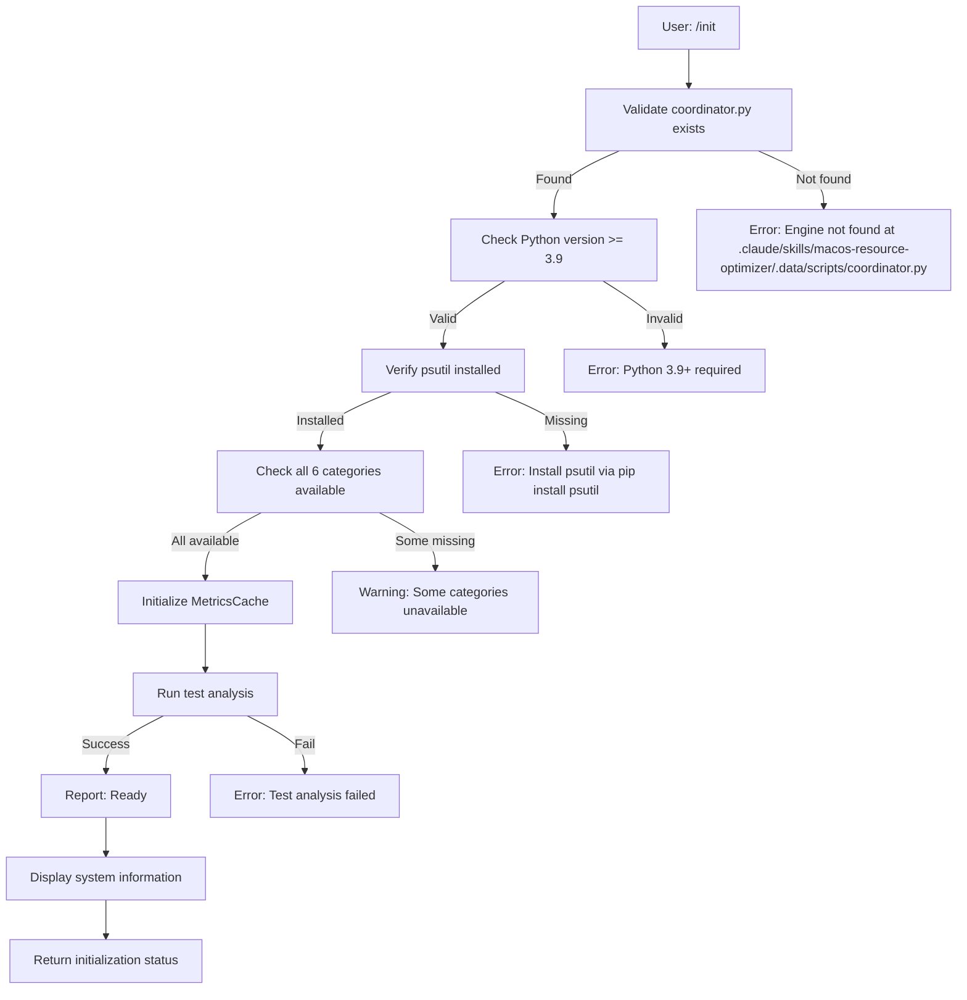
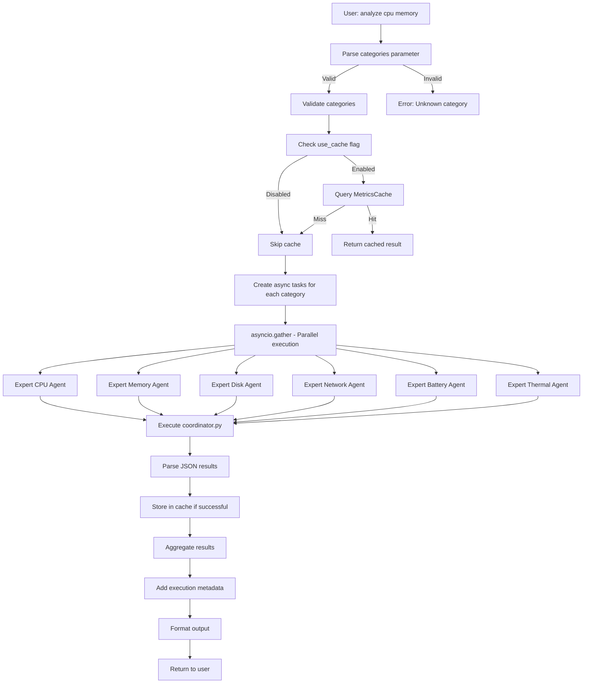
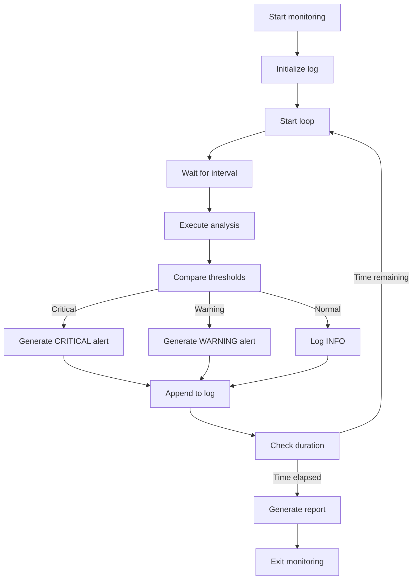
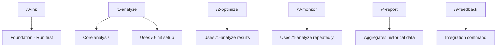

# Command Reference

Complete reference for all available commands in macOS Resource Optimizer, including syntax, parameters, workflows, and usage examples.

## Implementation Status

⚠️ **IMPORTANT**: This document describes the **conceptual command architecture**. The actual implementation uses **UV scripts** executed via `uv run`.

**Current Implementation** (as of 2025-11-30):
- ✅ 12 UV scripts implemented (status, analyze_*, optimize, monitor, report, cache)
- ✅ CLI executed via `uv run .data/scripts/[script].py`
- ✅ MoAI commands delegate to Bash("uv run") pattern
- 🔄 2/8 manager agents updated with Bash(uv run)
- 🔄 0/5 commands updated with UV script workflows
- 🔄 Integration testing in progress

**This Document Describes**:
- Conceptual command structure (/macos-resource-optimizer:0-9)
- Command workflows and parameters
- Agent delegation patterns
- Expected outputs and behaviors

**For Actual Usage**: Execute UV scripts directly:
```bash
uv run .claude/skills/macos-resource-optimizer/.data/scripts/status.py
uv run .claude/skills/macos-resource-optimizer/.data/scripts/analyze_cpu.py --json
uv run .claude/skills/macos-resource-optimizer/.data/scripts/analyze_all.py
```

---

## Command Catalog

### 1. /macos-resource-optimizer:0-init

**Purpose**: Initialize and validate macOS Resource Optimizer setup, checking Python engine readiness and dependencies.

**Status**: Foundation command - Must be run first

#### Usage Syntax

```bash
/macos-resource-optimizer:0-init
/macos-resource-optimizer:0-init --verbose
/macos-resource-optimizer:0-init --check-dependencies
```

#### Parameters

| Parameter | Type | Default | Description |
|-----------|------|---------|-------------|
| `--verbose` | flag | false | Print detailed output during initialization |
| `--check-dependencies` | flag | false | Verify all Python dependencies installed |
| `--validate-engine` | flag | false | Test coordinator.py execution |

#### Execution Workflow



#### Output Format

**Success Response**:
```json
{
  "status": "ready",
  "timestamp": 1704067200,
  "engine": {
    "path": ".claude/skills/macos-resource-optimizer/.data/scripts/coordinator.py",
    "exists": true,
    "executable": true
  },
  "python": {
    "version": "3.11.2",
    "location": "/usr/local/bin/python3",
    "valid": true
  },
  "dependencies": {
    "psutil": {
      "installed": true,
      "version": "5.9.5"
    },
    "numpy": {
      "installed": true,
      "version": "1.24.1"
    }
  },
  "categories": {
    "cpu": true,
    "memory": true,
    "disk": true,
    "network": true,
    "battery": true,
    "thermal": true
  },
  "test_result": {
    "success": true,
    "execution_time_ms": 234,
    "categories_tested": 6
  }
}
```

**Failure Response**:
```json
{
  "status": "not_ready",
  "errors": [
    {
      "component": "python_version",
      "message": "Python 3.8 found, 3.9+ required",
      "severity": "critical"
    },
    {
      "component": "dependency",
      "package": "psutil",
      "message": "Not installed",
      "fix": "pip install psutil",
      "severity": "critical"
    }
  ],
  "warnings": []
}
```

#### Delegation

**Primary Agent**: `manager-resource-coordinator`

**Sub-agents Called**: None (initialization only)

**Python Engine Command**:
```bash
uv run coordinator.py --status
```

#### Example Usage

```python
# Initialize before first use
/macos-resource-optimizer:0-init

# Verbose initialization with dependency check
/macos-resource-optimizer:0-init --verbose --check-dependencies

# Validate engine after updates
/macos-resource-optimizer:0-init --validate-engine
```

#### Troubleshooting

| Issue | Cause | Solution |
|-------|-------|----------|
| "Engine not found" | Missing .claude/skills/macos-resource-optimizer/.data directory | Clone/install Python engine |
| "Python 3.9+ required" | Outdated Python version | Update Python: `brew install python@3.11` |
| "psutil not installed" | Missing dependency | `pip install psutil` |
| "Test analysis failed" | Engine execution error | Check logs: `.claude/skills/macos-resource-optimizer/.data/logs/` |

---

### 2. /macos-resource-optimizer:1-analyze

**Purpose**: Execute parallel resource analysis across selected categories, collecting metrics with caching support.

**Status**: Core command - Most frequently used

#### Usage Syntax

```bash
/macos-resource-optimizer:1-analyze
/macos-resource-optimizer:1-analyze --categories=cpu,memory,disk
/macos-resource-optimizer:1-analyze --categories=cpu
/macos-resource-optimizer:1-analyze --no-cache
/macos-resource-optimizer:1-analyze --timeout=15
/macos-resource-optimizer:1-analyze --verbose
```

#### Parameters

| Parameter | Type | Default | Description |
|-----------|------|---------|-------------|
| `--categories` | string | all | Comma-separated list: cpu, memory, disk, network, battery, thermal |
| `--no-cache` | flag | false | Force fresh analysis, ignore cache |
| `--timeout` | int | 10 | Timeout per category in seconds |
| `--verbose` | flag | false | Print detailed metrics |
| `--format` | string | json | Output format: json, text, markdown |

#### Execution Workflow



#### Output Format

**Success Response** (JSON):
```json
{
  "status": "success",
  "execution_time_seconds": 1.8,
  "cache_hit_rate": 0.67,
  "analysis_timestamp": 1704067200.123,
  "categories": {
    "cpu": {
      "status": "success",
      "cached": false,
      "execution_time_ms": 250,
      "metrics": {
        "usage_percent": 45.2,
        "user_percent": 30.1,
        "system_percent": 15.1,
        "idle_percent": 54.8,
        "core_count": 8,
        "temperature_celsius": 65.0,
        "frequency_ghz": 2.4
      },
      "recommendations": [
        {
          "type": "info",
          "priority": "low",
          "message": "CPU usage within normal range"
        }
      ]
    },
    "memory": {
      "status": "success",
      "cached": true,
      "cache_age_seconds": 5,
      "metrics": {
        "usage_percent": 75.0,
        "used_gb": 12.5,
        "total_gb": 16.0,
        "swap_percent": 35.0,
        "memory_pressure": "normal",
        "pressure_level": 0.45
      },
      "recommendations": [
        {
          "type": "warning",
          "priority": "medium",
          "message": "Memory usage approaching 80% threshold"
        }
      ]
    },
    "disk": {
      "status": "success",
      "cached": false,
      "metrics": {
        "usage_percent": 65.0,
        "used_gb": 325.0,
        "total_gb": 500.0,
        "free_gb": 175.0,
        "io_read_per_sec": 15.2,
        "io_write_per_sec": 8.3
      },
      "recommendations": []
    },
    "network": {
      "status": "success",
      "cached": false,
      "metrics": {
        "bandwidth_in_mbps": 125.4,
        "bandwidth_out_mbps": 45.2,
        "active_connections": 87,
        "dropped_packets": 0.02,
        "latency_ms": 25.3
      },
      "recommendations": []
    },
    "battery": {
      "status": "success",
      "cached": true,
      "metrics": {
        "percentage": 85.0,
        "time_remaining_hours": 4.5,
        "charging": false,
        "health_percent": 92.0,
        "cycle_count": 245
      },
      "recommendations": []
    },
    "thermal": {
      "status": "success",
      "cached": false,
      "metrics": {
        "cpu_temp_celsius": 65.0,
        "gpu_temp_celsius": 52.0,
        "fan_speed_rpm": 2500,
        "thermal_throttling": false
      },
      "recommendations": []
    }
  },
  "summary": {
    "total_categories": 6,
    "successful": 6,
    "failed": 0,
    "system_health": "good",
    "issues_found": 1,
    "critical_issues": 0
  }
}
```

**Partial Failure Response**:
```json
{
  "status": "partial",
  "execution_time_seconds": 2.5,
  "categories": {
    "cpu": { "status": "success", ... },
    "memory": { "status": "success", ... },
    "disk": { "status": "error", "error_message": "Timeout exceeded 10s" },
    ...
  },
  "errors": [
    {
      "category": "disk",
      "error": "AnalysisTimeoutError",
      "message": "Disk analysis exceeded 10s timeout",
      "fallback": "Using cache from 45 seconds ago",
      "recovery_time_ms": 85
    }
  ]
}
```

**Text Format Output**:
```
MacOS RESOURCE ANALYSIS
=======================
Timestamp: 2024-01-01 10:00:00

CPU Analysis
├─ Usage: 45.2% (good)
├─ Cores: 8
├─ Temperature: 65°C
└─ Status: Normal

MEMORY Analysis
├─ Usage: 75.0% (warning)
├─ Used: 12.5 GB / 16.0 GB
├─ Swap: 35.0%
└─ Status: High

Execution Summary
├─ Total time: 1.8 seconds
├─ Cache hits: 2/6
└─ Issues found: 1
```

#### Delegation

**Primary Agent**: `manager-resource-coordinator`

**Sub-agents Called** (parallel):
- `expert-cpu-optimizer`
- `expert-memory-optimizer`
- `expert-disk-optimizer`
- `expert-network-optimizer`
- `expert-battery-optimizer`
- `expert-thermal-optimizer`

**Python Engine Commands**:
```bash
uv run coordinator.py --analyze --category=cpu
uv run coordinator.py --analyze --category=memory
uv run coordinator.py --analyze --category=disk
# ... (all 6 in parallel)
```

#### Performance Characteristics

| Scenario | Time | Cache Status |
|----------|------|--------------|
| All fresh | 2.5s | 0% hit |
| Typical usage (60% hit) | 1.5s | 60% hit |
| All cached | 0.01s | 100% hit |
| With 2 timeouts | 2.5s + fallback | Partial |

#### Example Usage

```python
# Analyze all categories
/macos-resource-optimizer:1-analyze

# Analyze specific categories
/macos-resource-optimizer:1-analyze --categories=cpu,memory

# Force fresh analysis, ignore cache
/macos-resource-optimizer:1-analyze --no-cache

# Analyze with longer timeout
/macos-resource-optimizer:1-analyze --timeout=20

# Verbose output with detailed metrics
/macos-resource-optimizer:1-analyze --verbose
```

---

### 3. /macos-resource-optimizer:2-optimize

**Purpose**: Execute resource optimizations with interactive user approval for each recommendation.

**Status**: Action command - Modifies system

#### Usage Syntax

```bash
/macos-resource-optimizer:2-optimize
/macos-resource-optimizer:2-optimize --auto-approve=low
/macos-resource-optimizer:2-optimize --dry-run
/macos-resource-optimizer:2-optimize --categories=cpu,memory
```

#### Parameters

| Parameter | Type | Default | Description |
|-----------|------|---------|-------------|
| `--auto-approve` | string | none | Auto-approve levels: low, medium, high, all |
| `--dry-run` | flag | false | Simulate optimizations without execution |
| `--categories` | string | all | Limit optimizations to specific categories |
| `--timeout` | int | 30 | Timeout for user approval window |

#### Execution Workflow

**Phase 1: Analysis**
```
User: /optimize
↓
Coordinator: Run analyze (same as command 1)
↓
Return aggregated results
```

**Phase 2: Strategy**
```
Strategy Agent: Analyze results
↓
Generate recommendations
↓
Score priorities (0-100)
↓
Assess risks (low/medium/high)
↓
Create optimization plan
```

**Phase 3: User Approval**
```
Present recommendations (Korean)
↓
User selects approvals
↓
Generate execution order
```

**Phase 4: Execution**
```
Apply optimizations in order
↓
Monitor for side effects
↓
Collect metrics
↓
Generate report
```

#### Output Format

**User Approval Prompt** (Korean):

```
다음 최적화를 실행하시겠습니까?

[1] CPU 최적화 (우선순위: 85/100) ⚠️ 중간 위험도
    CPU 사용률이 85%로 높음
    불필요한 프로세스 8개 종료 권장
    예상 개선: 25% 성능 향상
    소요 시간: 2초

    [ ] 실행
    [ ] 롤백 계획 보기
    [ ] 건너뛰기

[2] 메모리 최적화 (우선순위: 72/100) ⚠️ 낮음 위험도
    메모리 사용률 75% (경고 수준)
    캐시 정리 및 메모리 압축 권장
    예상 개선: 15% 메모리 확보
    소요 시간: 3초

    [ ] 실행
    [ ] 건너뛰기

[3] 디스크 최적화 (우선순위: 45/100) ✅ 낮음 위험도
    디스크 사용률 65% (정상)
    권장: 임시 파일 정리
    예상 개선: 3GB 확보

    [ ] 실행
    [ ] 건너뛰기

---

선택을 입력하세요 (예: "1 2" 또는 "모두 실행"):
```

**Execution Report**:
```json
{
  "status": "completed",
  "execution_start": 1704067200.123,
  "execution_end": 1704067205.456,
  "total_duration_seconds": 5.333,
  "optimizations_executed": [
    {
      "category": "cpu",
      "action": "Terminated 8 background processes",
      "status": "success",
      "duration_seconds": 1.2,
      "metrics_before": {
        "cpu_usage_percent": 85.0,
        "processes": 156
      },
      "metrics_after": {
        "cpu_usage_percent": 62.0,
        "processes": 148
      },
      "improvement_percent": 23.0,
      "rollback_available": true
    },
    {
      "category": "memory",
      "action": "Compressed memory, cleared caches",
      "status": "success",
      "duration_seconds": 2.1,
      "metrics_before": {
        "memory_usage_percent": 75.0,
        "used_gb": 12.5
      },
      "metrics_after": {
        "memory_usage_percent": 58.0,
        "used_gb": 9.3
      },
      "improvement_percent": 17.0,
      "memory_freed_gb": 3.2,
      "rollback_available": false
    }
  ],
  "skipped": [
    {
      "category": "disk",
      "reason": "User skipped",
      "recommendation": "Would have freed 3GB"
    }
  ],
  "summary": {
    "total_recommendations": 3,
    "executed": 2,
    "skipped": 1,
    "failed": 0,
    "total_improvement_percent": 20.0,
    "system_health_before": "good",
    "system_health_after": "excellent"
  },
  "rollback_plan": {
    "supported": true,
    "instructions": "Run /macos-resource-optimizer:restore-optimization-001",
    "window_hours": 24
  }
}
```

**Dry Run Output**:
```json
{
  "mode": "dry_run",
  "status": "simulated",
  "optimizations_that_would_execute": [
    {
      "category": "cpu",
      "action": "Would terminate 8 background processes",
      "estimated_improvement_percent": 23.0,
      "estimated_duration_seconds": 1.2,
      "estimated_risk": "low"
    }
  ],
  "note": "No changes made. Re-run without --dry-run to execute."
}
```

#### Delegation

**Primary Agents**:
1. `manager-resource-coordinator` (Analysis phase)
2. `manager-resource-strategy` (Strategy & approval)
3. Expert agents (Execution phase)

**Python Engine Commands**:
```bash
# Execute CPU optimization
uv run coordinator.py --optimize --category=cpu --dry-run

# Execute memory optimization
uv run coordinator.py --optimize --category=memory
```

#### Example Usage

```python
# Interactive optimization with user approval
/macos-resource-optimizer:2-optimize

# Auto-approve low-risk optimizations
/macos-resource-optimizer:2-optimize --auto-approve=low

# Simulation mode (no changes)
/macos-resource-optimizer:2-optimize --dry-run

# Optimize specific categories
/macos-resource-optimizer:2-optimize --categories=cpu,memory
```

---

### 4. /macos-resource-optimizer:3-monitor

**Purpose**: Continuous monitoring with periodic analysis and alert generation.

**Status**: Monitoring command - Long-running process

#### Usage Syntax

```bash
/macos-resource-optimizer:3-monitor
/macos-resource-optimizer:3-monitor --interval=60
/macos-resource-optimizer:3-monitor --alert-threshold=critical
/macos-resource-optimizer:3-monitor --duration=3600
/macos-resource-optimizer:3-monitor --log-file=monitor.log
```

#### Parameters

| Parameter | Type | Default | Description |
|-----------|------|---------|-------------|
| `--interval` | int | 300 | Analysis interval in seconds (300 = 5min) |
| `--alert-threshold` | string | warning | Alert level: critical, warning, info |
| `--duration` | int | 86400 | Total monitoring duration in seconds (86400 = 24h) |
| `--log-file` | string | auto | Log file location |
| `--auto-fix` | flag | false | Auto-apply low-risk optimizations |

#### Execution Workflow



#### Output Format

**Real-time Dashboard**:
```
===== MACOS RESOURCE MONITOR =====
Started: 2024-01-01 10:00:00
Elapsed: 0h 15m 30s

CPU:      45.2% [████░░░░░░░░░░░░░░] Normal
Memory:   75.0% [██████████████░░░░░] High   ⚠️
Disk:     65.0% [████████████░░░░░░░] Normal
Network:  125 Mbps (in), 45 Mbps (out)
Battery:  85% | 4.5h remaining
Thermal:  65°C CPU | 52°C GPU | 2500 RPM

Alerts (3):
🟡 [09:45] Memory usage above 75%
🟡 [10:15] CPU temperature approaching limit (65°C)

Recommendations:
1. Memory: Clear caches (priority 72/100)
2. CPU: Reduce background processes (priority 85/100)

Press 'q' to quit, 'a' for auto-optimize
```

**Log File Format**:
```
[2024-01-01 10:00:00] MONITOR STARTED - Interval: 300s, Duration: 3600s
[2024-01-01 10:00:05] ANALYSIS - CPU: 45.2%, Memory: 75.0%, Disk: 65.0%
[2024-01-01 10:00:05] STATUS - All systems normal
[2024-01-01 10:05:00] ANALYSIS - CPU: 52.0%, Memory: 78.0%, Disk: 65.2%
[2024-01-01 10:05:00] ALERT - WARNING - Memory approaching threshold (78.0%)
[2024-01-01 10:10:00] ANALYSIS - CPU: 48.0%, Memory: 82.0%, Disk: 65.4%
[2024-01-01 10:10:00] ALERT - CRITICAL - Memory above critical threshold (82.0%)
[2024-01-01 10:10:05] ACTION - Auto-optimization initiated
[2024-01-01 10:10:08] ACTION - Memory optimization completed (freed 2.3GB)
[2024-01-01 10:10:08] ANALYSIS - CPU: 48.0%, Memory: 68.0%, Disk: 65.4%
[2024-01-01 10:10:08] STATUS - System recovered to normal
...
[2024-01-01 11:00:00] MONITOR COMPLETED - Summary report generated
```

**Summary Report**:
```json
{
  "monitoring_session": {
    "start_time": 1704067200,
    "end_time": 1704070800,
    "duration_seconds": 3600,
    "interval_seconds": 300,
    "analyses_run": 13
  },
  "statistics": {
    "cpu": {
      "avg_percent": 45.2,
      "max_percent": 55.0,
      "min_percent": 35.0,
      "std_dev": 6.2
    },
    "memory": {
      "avg_percent": 74.0,
      "max_percent": 82.0,
      "min_percent": 68.0,
      "std_dev": 4.5
    }
  },
  "alerts_triggered": [
    {
      "timestamp": 1704068100,
      "level": "warning",
      "category": "memory",
      "message": "Memory above 75%"
    },
    {
      "timestamp": 1704068400,
      "level": "critical",
      "category": "memory",
      "message": "Memory above 80%"
    }
  ],
  "optimizations_applied": [
    {
      "timestamp": 1704068405,
      "category": "memory",
      "action": "Compressed memory, cleared caches",
      "result": "Freed 2.3GB"
    }
  ],
  "system_health": {
    "start": "good",
    "end": "excellent",
    "trend": "improving"
  }
}
```

#### Alert Levels

| Level | Condition | Action |
|-------|-----------|--------|
| 🔴 Critical | Score 90+ | Immediate alert, user notification |
| 🟡 Warning | Score 70-89 | Alert, optional auto-optimization |
| 🟢 Normal | Score <70 | Log only, no alert |

#### Delegation

**Primary Agent**: `manager-resource-coordinator` (loop mode)

**Loop Behavior**: Repeats analysis every `--interval` seconds

#### Example Usage

```python
# Start monitoring (default 5min interval, 24h duration)
/macos-resource-optimizer:3-monitor

# Custom interval (30 seconds) for intensive testing
/macos-resource-optimizer:3-monitor --interval=30

# Only show critical alerts
/macos-resource-optimizer:3-monitor --alert-threshold=critical

# Monitor for 2 hours
/macos-resource-optimizer:3-monitor --duration=7200

# Auto-optimize on warnings
/macos-resource-optimizer:3-monitor --interval=60 --auto-fix
```

---

### 5. /macos-resource-optimizer:4-report

**Purpose**: Generate comprehensive historical reports in multiple formats.

**Status**: Reporting command - Data export

#### Usage Syntax

```bash
/macos-resource-optimizer:4-report
/macos-resource-optimizer:4-report --format=markdown
/macos-resource-optimizer:4-report --format=json
/macos-resource-optimizer:4-report --format=html
/macos-resource-optimizer:4-report --days=7
/macos-resource-optimizer:4-report --output=custom_report.md
```

#### Parameters

| Parameter | Type | Default | Description |
|-----------|------|---------|-------------|
| `--format` | string | markdown | Output format: markdown, json, html, csv |
| `--days` | int | 1 | Historical data span in days |
| `--output` | string | auto | Custom output file path |
| `--include-metrics` | flag | true | Include detailed metrics tables |
| `--include-charts` | flag | true | Include visual charts (HTML/Markdown) |

#### Output Format

**Markdown Report**:
```markdown
# MacOS Resource Analysis Report
**Generated**: 2024-01-01 10:00:00
**Period**: Last 24 hours
**System**: MacBook Pro 14-inch M1 Pro

## Executive Summary

| Metric | Current | Average | Max | Status |
|--------|---------|---------|-----|--------|
| CPU Usage | 45.2% | 42.1% | 78.0% | ✅ Normal |
| Memory | 75.0% | 71.3% | 85.0% | ⚠️ High |
| Disk | 65.0% | 64.8% | 67.0% | ✅ Normal |
| Battery | 85% | 78% | 95% | ✅ Healthy |

## Detailed Analysis

### CPU Analysis
- **Current**: 45.2%
- **Trend**: Stable (±2%)
- **Top Processes**: Chrome (12.5%), Xcode (8.3%), Slack (4.2%)
- **Recommendation**: Normal operation

### Memory Analysis
- **Current**: 75.0% (12.5GB / 16GB)
- **Trend**: Rising (+3% from 24h avg)
- **Pressure**: Normal (0.45)
- **Recommendation**: Monitor, consider cleanup if exceeds 80%

[... additional sections ...]

## Optimization History
| Timestamp | Action | Result | Status |
|-----------|--------|--------|--------|
| 2024-01-01 09:30 | Memory cleanup | Freed 2.3GB | ✅ Success |
| 2024-01-01 09:15 | CPU optimization | Reduced 8 processes | ✅ Success |

## Recommendations
1. **Memory (Priority 72)**: Clear cache when exceeding 80%
2. **Disk (Priority 45)**: Cleanup temporary files (safe, optional)
3. **Battery (Priority 30)**: Consider enabling power saving at <20%
```

**JSON Report**:
```json
{
  "report": {
    "generated_at": 1704067200,
    "period": {
      "start": 1704067200,
      "end": 1704153600,
      "days": 1
    },
    "system_info": {
      "model": "MacBook Pro 14-inch M1 Pro",
      "macos_version": "14.2",
      "python_version": "3.11.2"
    },
    "metrics": {
      "cpu": {
        "current": 45.2,
        "average": 42.1,
        "max": 78.0,
        "min": 22.0,
        "status": "normal"
      },
      "memory": {
        "current": 75.0,
        "average": 71.3,
        "max": 85.0,
        "min": 58.0,
        "status": "high",
        "used_gb": 12.5,
        "total_gb": 16.0
      }
    },
    "optimizations": [
      {
        "timestamp": 1704067800,
        "category": "memory",
        "action": "Cleanup caches",
        "freed_gb": 2.3,
        "status": "success"
      }
    ]
  }
}
```

**HTML Report**: Interactive dashboard with charts

#### Output Locations

Reports are saved to:
```
.claude/skills/macos-resource-optimizer/.data/reports/
├── analysis-2024-01-01-100000.md         # Latest markdown
├── analysis-2024-01-01-100000.json       # Latest JSON
├── analysis-2024-01-01-100000.html       # Latest HTML
├── monthly-2024-01.json                  # Monthly summary
└── archive/                               # Historical
    └── analysis-2023-12-*.{md,json,html}
```

#### Delegation

**Primary Agent**: `manager-resource-coordinator`

**Processing**: Result aggregation and formatting (no analysis)

#### Example Usage

```python
# Generate markdown report (current day)
/macos-resource-optimizer:4-report

# JSON format for data export
/macos-resource-optimizer:4-report --format=json

# HTML dashboard for last 7 days
/macos-resource-optimizer:4-report --format=html --days=7

# Save to custom location
/macos-resource-optimizer:4-report --output=~/Desktop/my_report.md
```

---

### 6. /macos-resource-optimizer:9-feedback

**Purpose**: Submit feedback and improvement suggestions to MoAI-ADK ecosystem.

**Status**: Integration command - Feedback loop

#### Usage Syntax

```bash
/macos-resource-optimizer:9-feedback
/macos-resource-optimizer:9-feedback "improvement: Add GPU monitoring"
/macos-resource-optimizer:9-feedback "bug: CPU timeout on M1 Ultra"
/macos-resource-optimizer:9-feedback "feature: Real-time dashboard"
```

#### Parameters

| Parameter | Type | Description |
|-----------|------|-------------|
| `$1` | string | Feedback type and message |

#### Feedback Types

| Type | Priority | Example |
|------|----------|---------|
| `bug` | High | "bug: Timeout on specific category" |
| `improvement` | Medium | "improvement: Add GPU monitoring" |
| `feature` | Medium | "feature: Real-time dashboard" |
| `error` | High | "error: Description of encountered error" |

#### Output Format

```json
{
  "feedback_submitted": {
    "timestamp": 1704067200,
    "type": "improvement",
    "message": "Add GPU monitoring for Mac Studios",
    "status": "submitted",
    "feedback_id": "FEEDBACK-2024-0001",
    "destination": "/moai:9-feedback"
  }
}
```

#### Delegation

**Target**: Directly forwards to `/moai:9-feedback`

**Context Passed**: macOS-specific metrics and system information

#### Example Usage

```python
# Submit improvement
/macos-resource-optimizer:9-feedback "improvement: Add process-level caching"

# Report bug
/macos-resource-optimizer:9-feedback "bug: Thermal analysis times out on M1 Max"

# Request feature
/macos-resource-optimizer:9-feedback "feature: Integration with Activity Monitor"
```

---

## Command Hierarchy and Dependencies



## Quick Command Reference Table

| Command | Purpose | Time | Modifies System |
|---------|---------|------|-----------------|
| `:0-init` | Initialization | 2-5s | No |
| `:1-analyze` | Analysis only | 1-2.5s | No |
| `:2-optimize` | Analysis + Optimization | 5-30s | Yes |
| `:3-monitor` | Continuous monitoring | Configurable | Optional |
| `:4-report` | Report generation | 1-5s | No |
| `:9-feedback` | Send feedback | <1s | No |

## Performance Characteristics

All commands include timeout protection and cache optimization:

- **Initialization**: 2-5 seconds (one-time)
- **Analysis**: 1-2.5 seconds (cached or fresh)
- **Optimization**: 5-30 seconds (depends on category count)
- **Monitoring**: Per-interval performance
- **Reporting**: 1-5 seconds (depends on format)

## Error Codes

| Code | Meaning | Recovery |
|------|---------|----------|
| 100 | Initialization failed | Run `:0-init` again |
| 101 | Analysis timeout | Retry or increase timeout |
| 102 | Optimization failed | Check system state, retry |
| 200 | Unknown category | Check category name |
| 201 | Invalid parameter | Review command syntax |

---

**Reference Version**: 1.0.0
**Last Updated**: 2025-11-29
**Status**: Complete with 6 core commands
